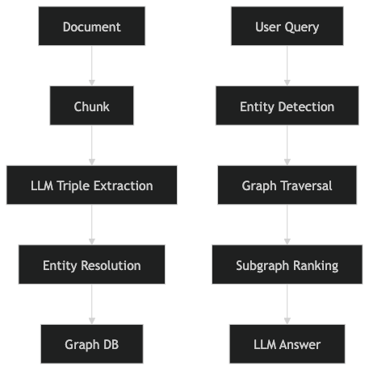

# GraphRAG – Production Architecture Overview

> The notebook example is only meant to give a basic intuition of what GraphRAG is.  
> Below is how a **real-world, production-grade GraphRAG pipeline** typically works.

---

## 🏗 Real GraphRAG Pipeline (Production View)

In a production system, GraphRAG is not just a graph + LLM call.  
It involves structured ingestion, entity resolution, graph traversal, and controlled context building.

---

## 📥 Ingestion Pipeline

### 1️⃣ Chunk the Document

- Split long documents into manageable sections
- Preserve semantic boundaries where possible (sections, headings, paragraphs)
- Maintain metadata (source, page number, timestamps, etc.)

---

### 2️⃣ Extract Triples with LLM

For each chunk:

- Use an LLM to extract:
  - **Entities**
  - **Relationships**
  - **Structured triples** (subject–predicate–object)

Example: 
(OpenAI) — developed → (GPT-4)
(Microsoft) — invested_in → (OpenAI)

#### 🔁 Entity Resolution (Critical Step)

Before inserting into the graph:

- Check if similar entities already exist
- Resolve duplicates (e.g., "MSFT" vs "Microsoft")
- Merge aliases
- Handle conflicts
- Maintain canonical entity IDs

This prevents graph fragmentation and duplication.

---

### 3️⃣ Store in Graph Database

Store resolved triples in a graph database such as:

- Neo4j
- TigerGraph
- DGraph

Graph schema typically includes:

- Entity nodes
- Relationship edges
- Properties (timestamps, source references, confidence score, etc.)

---

## 🔎 Query-Time Retrieval Pipeline

When a user submits a query:

---

### 4️⃣ Entity Detection

- Extract entities from the user query
- Map them to canonical graph nodes

Example:
Query: How is Microsoft related to ChatGPT?
Detected entities: Microsoft, ChatGPT

---

### 5️⃣ Graph Expansion

Perform controlled traversal:

- 1-hop expansion (direct relationships)
- 2-hop expansion (multi-step reasoning)
- Path discovery between entities
- Subgraph extraction

This enables multi-hop reasoning instead of shallow similarity search.

---

### 6️⃣ Subgraph Ranking

Rank retrieved subgraphs using signals such as:

- Path length
- Edge confidence
- Relationship type importance
- Recency
- Domain-specific weighting

Select the most relevant subgraph.

---

### 7️⃣ Structured Context → LLM

Convert subgraph into structured natural language context:
Microsoft invested_in OpenAI.
OpenAI developed GPT-4.
GPT-4 powers ChatGPT.

Send this structured, reasoning-ready context to the LLM to generate the final answer.

---

## 🎯 Why This Works

Compared to traditional vector-based RAG:

- Enables multi-hop reasoning
- Improves explainability
- Avoids semantic similarity errors
- Provides traceable relationship paths
- Works well for structured knowledge domains

---

## 🧠 When to Use GraphRAG

GraphRAG is particularly powerful for:

- Finance
- Legal
- Scientific research
- Enterprise knowledge graphs
- Compliance-heavy domains
- Multi-entity relationship queries

---

## 🔥 Summary Architecture
Document → Chunk → LLM Triple Extraction → Entity Resolution → Graph DB

User Query → Entity Detection → Graph Traversal → Subgraph Ranking → LLM Answer

